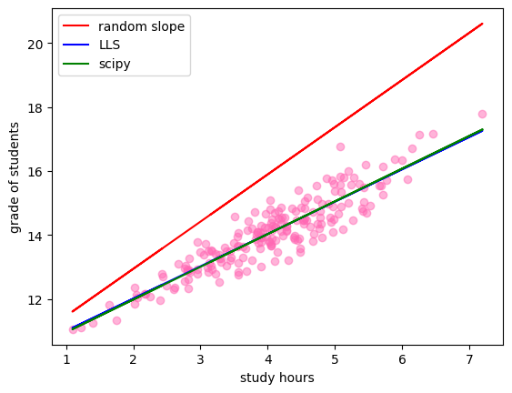

Assignment 44
1- Linear Least Squares (LLS)

    Students Performance (Regression)

​
​
Generate continuous random dataset for the problem of X = study hours and Y = grade of students (if you study more, you will get a higher grade).
Split your dataset to train and test with train_test_split function.
Draw some wrong red lines with a random slope.
Draw the correct blue line using your Object Oriented Linear Least Squares (LLS) method.

​

Draw a green line using linregress from scipy library. Compare your result with scipy's result.

2- Boston house-prices (Regression) 🏠

Load Boston dataset from the scikit-learn library.
This dataset has 13 features for each house. According to data correlation and your analysis, choose 2 features for X, for example:
X = area and age 
and choose 1 target for Y:
Y = price
Split the dataset to train and test with train_test_split function.
Solve the regression problem on 2 dimensions (2 features) using your Object Oriented LLS.
Show results on a 3D plot and draw the y_pred as a plane on it.

    ​

​