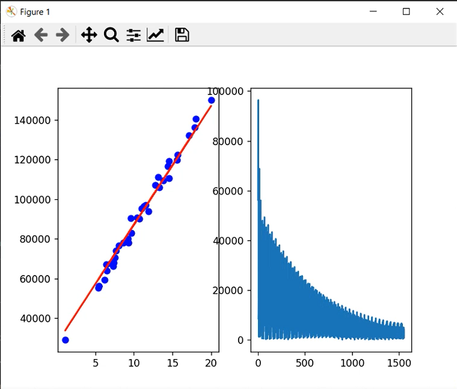
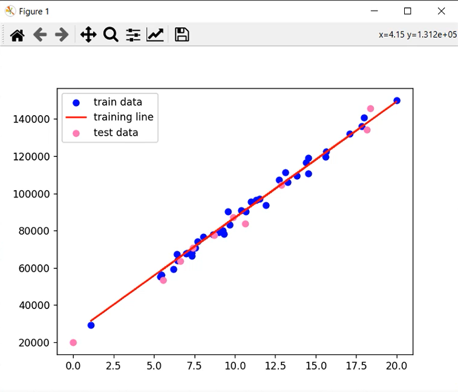
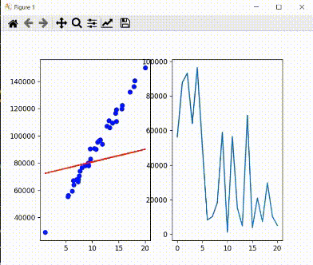
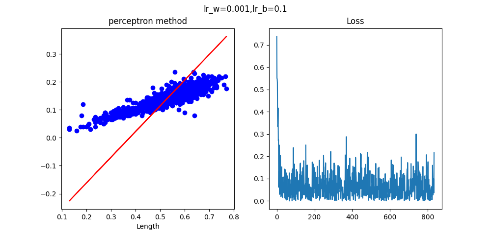
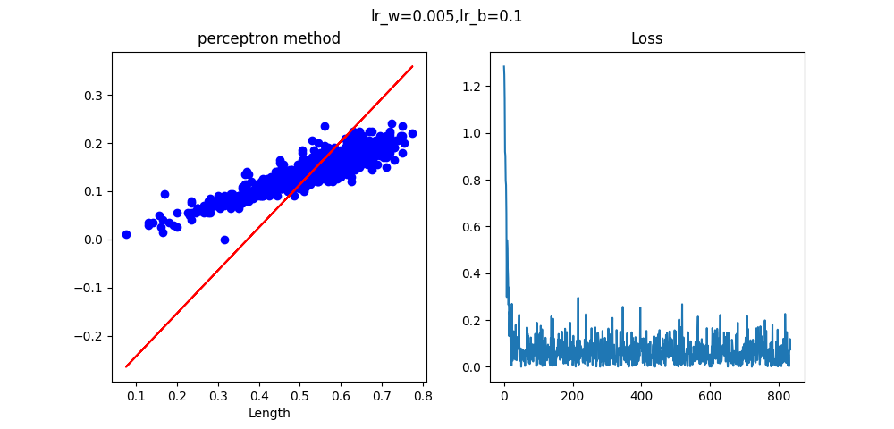
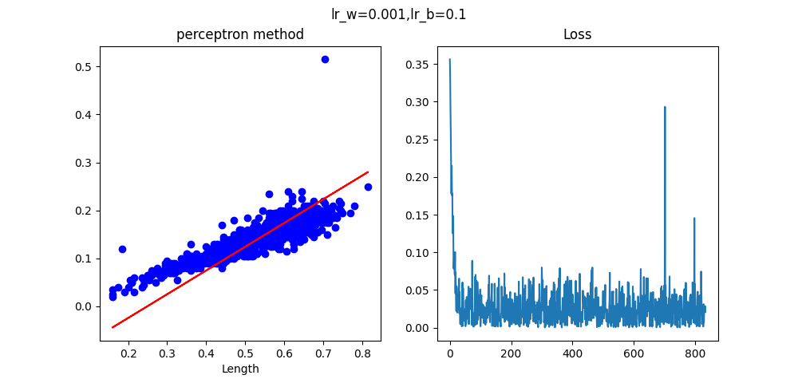
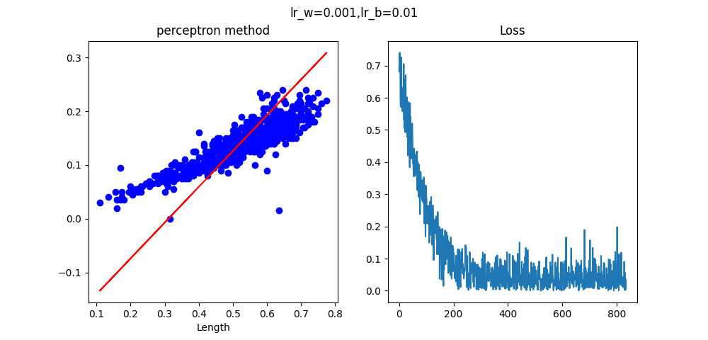
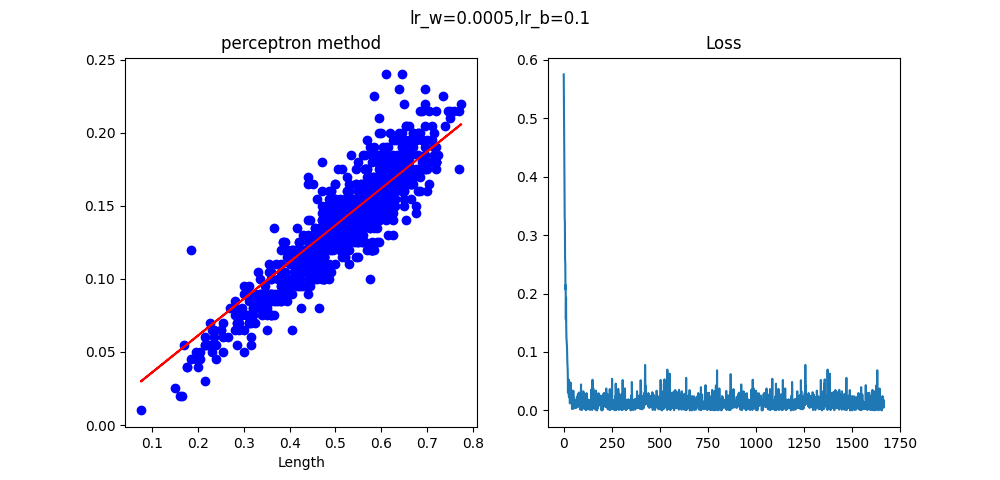
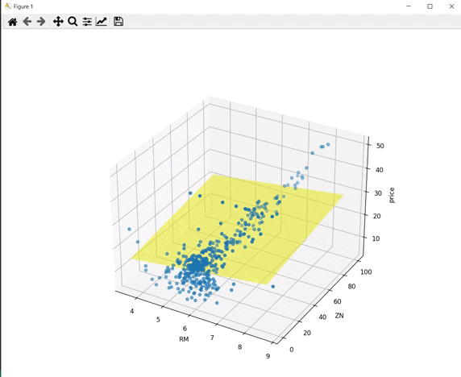

46-1: Employee's salary 💵

----------------------------
lr_W=0.0001
lr_b=0.1
epochs=50

Y_perd=
[[136760.27805821]
 [115039.50375912]
 [ 85740.24804616]
 [105937.2896874 ]
 [103638.53448008]
 [110494.36618343]
 [ 57280.29362487]
 [ 62475.93078933]
 [ 69590.68194774]
 [ 71026.73158495]]

Y_test=
[[140618.64369587]
 [119094.99254408]
 [ 87146.03312408]
 [111272.5617633 ]
 [107161.06777428]
 [109534.1014463 ]
 [ 55367.94661558]
 [ 59313.92144037]
 [ 66336.57212506]
 [ 70739.78967118]]

MSE=9943262.42688934
-------------------
lr_W=0.0005
lr_b=0.01
epochs=50

MSE=3616121.1856670207
------------------
lr_W=0.001
lr_b=0.5
epochs=50

MSE=15613487.734579062

***********************************************************
46-2: Abalone 
    Fit your perceptron algorithm on the abalone dataset
    Plot data graph and loss graph as 2 subplots in 1 window
    Change hyperparameters for get best result
    

***********************************************************
46-3: Boston house-prices

weight=[5.02000221, 0.06083263], bias=[-11.72771877]

