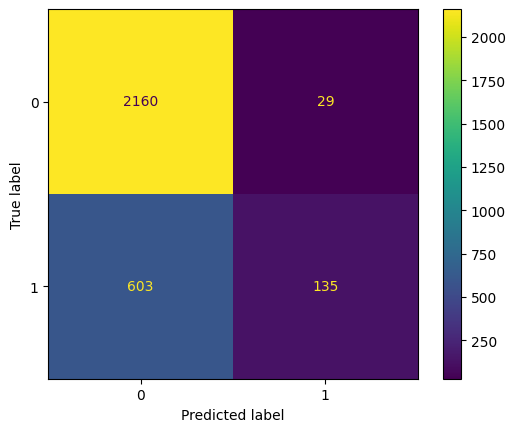
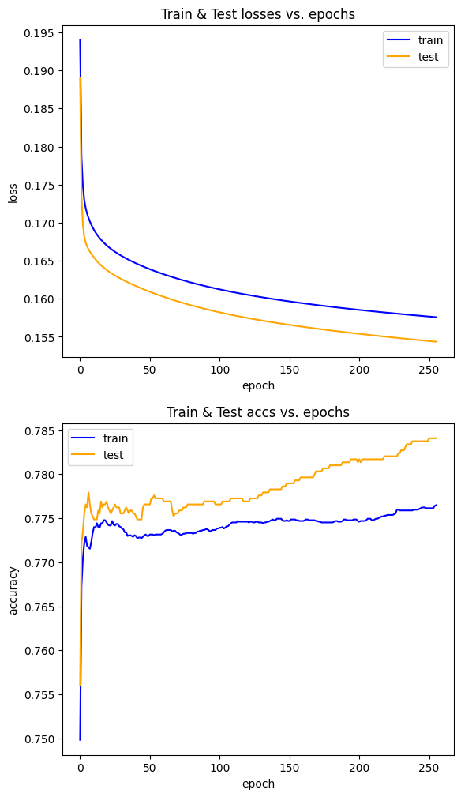
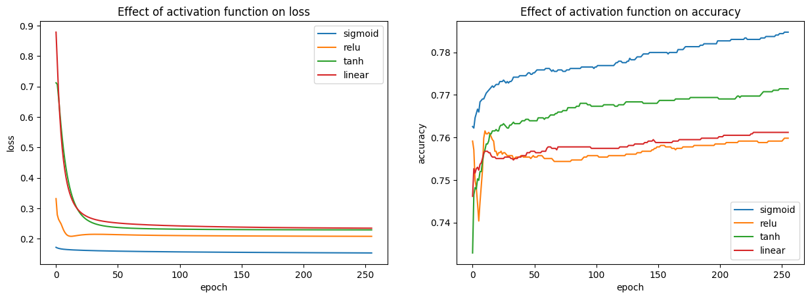

47-1:  Surgical 🏨

- Fit an object oriented perceptron algorithm on the surgical dataset for classification

- Plot accuracy in each epoch for train and test data
- Plot loss in each epoch for train and test data
- Calculate confusion matrix
- Repeat the above steps with 5 different activation functions, e.g. sigmoid, tanh, relu, linear, etc.

