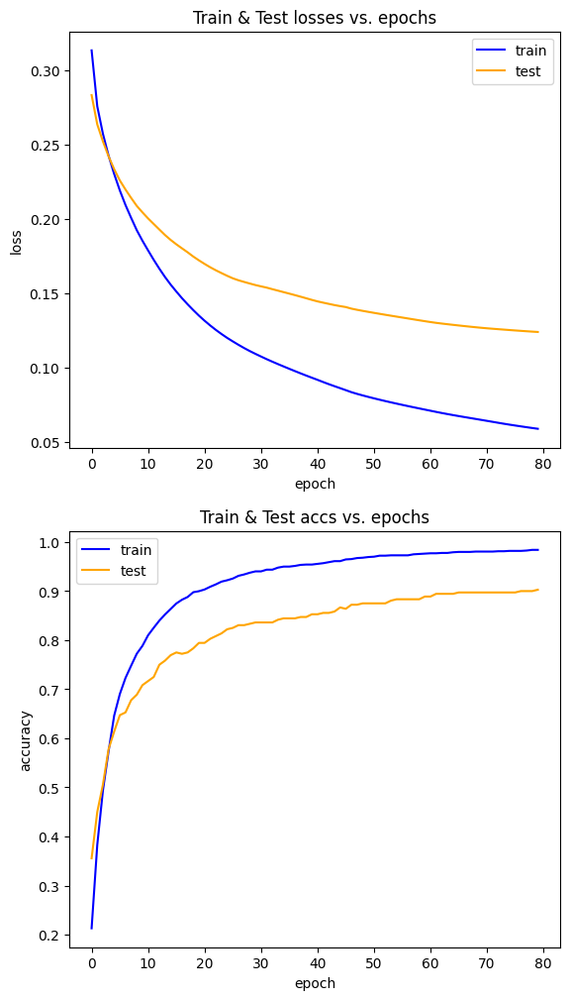

48-1:

Implement Percision and Recall functions from scratch, Then compare your results with Scikit-Learn.

loss, accuracy= 
(0.15592233965301064, 0.7857874957294158)

precision_score_sklearn:  0.6501128668171557
recall_score_sklearn:  0.37894736842105264

precision_score_scratch , recall_score_scratch =  (0.6501128668171557, 0.37894736842105264)

48-2:

Implement a simple neural network (Multi Layer Perceptron) on Scikit-Learn digits dataset
Implement your neural network as a class (Object Oriented Programming)
Implement OneHotEncoder and OneHotDecoder functions from scratch, Then compare your function with Scikit-Learn
Implement fit, evaluate and predict methods
Check your predict method with images of the numbers you wrote in your own handwriting

[array([[0.00632023, 0.0425815 , 0.50244187, 0.01715924, 0.20565716,
        0.00677909, 0.04011631, 0.0087609 , 0.0333466 , 0.13683711]])]
        
2

VERY IMPORTANT!!!! Report your loss and accuracy on train and test data in readme.md

 accuracy_train             loss_train              accuracy_test              loss_test        
   0.21294363256784968      0.31331873479917205      0.35555555555555557      0.2832594722051313    
   0.3827418232428671       0.2757610290297452              0.45              0.2635995210054947    
   0.4933890048712596       0.25733519932269416      0.5055555555555555       0.2521971146007822    
   0.5734168406402227       0.24261491070151667      0.5777777777777777       0.24215408982197284   
   0.6464857341684064       0.23019429853994838      0.6138888888888889       0.23345555919700275   
   0.6903270702853166       0.2191705422748717       0.6472222222222223       0.22592953962936274   
   0.7230340988169798       0.2094044747218209       0.6527777777777778       0.21981113777376157   
   0.7480862908837856       0.20075873888827142      0.6777777777777778       0.21416760568239665   
   0.7724425887265136       0.1924714790051447       0.6888888888888889       0.20879835271951053   
   0.7884481558803061       0.18540973260922575      0.7083333333333334       0.20449099595854164   
   0.8100208768267223       0.17890523163865438      0.7166666666666667       0.20040379038290582   
    0.825330549756437        0.17257873362372               0.725             0.19665713393201176   
   0.8399443284620738       0.16660558341880202             0.75              0.19292874882028846   
   0.8524704244954767       0.16101969526537666      0.7583333333333333       0.18922840535679783   
   0.8636047320807237        0.155925227384845       0.7694444444444445       0.1859475216091614    
   0.8747390396659708       0.1512809893677934              0.775             0.18302174986441772   
   0.8823938761308281       0.1468336417945461       0.7722222222222223       0.18030831542589454   
   0.8879610299234516       0.14271358741895554             0.775             0.17764909017125058   
   0.8977035490605428       0.1388169067795874       0.7833333333333333       0.17479548235884498   
   0.8997912317327766       0.1351068716187218       0.7944444444444444       0.17224206370541714   
   0.9032707028531664       0.13169048823549886      0.7944444444444444       0.16985108509947305   
   0.9088378566457899       0.12848415407934072      0.8027777777777778       0.16759642377744977   
   0.9137091162143354       0.1255029608845464       0.8083333333333333       0.1655527738435551    
    0.919276270006959       0.12274539264341226      0.8138888888888889       0.16367394729576712   
   0.9220598469032707       0.12014981515067838      0.8222222222222222       0.16185722396996655   
   0.9255393180236604       0.11778562739657843             0.825             0.16017730169437827   
   0.9311064718162839       0.11549986118483627      0.8305555555555556       0.15885623963491338   
   0.9338900487125957       0.11333446760772223      0.8305555555555556       0.15774857921771537   
   0.9373695198329853       0.11130526558282758      0.8333333333333334       0.1566838036617775    
   0.9401530967292971       0.10942450637636457      0.8361111111111111       0.15565320312184533   
   0.9401530967292971       0.10762579223089853      0.8361111111111111       0.1547652938782823    
   0.9436325678496869       0.1058482793511123       0.8361111111111111       0.15392002828772108   
   0.9436325678496869       0.10416520675509053      0.8361111111111111       0.15287935555791854   
   0.9478079331941545       0.1025317264306724       0.8416666666666667       0.15189132036162653   
   0.9498956158663883       0.10094657732774985      0.8444444444444444       0.15088644433415038   
   0.9498956158663883       0.09937761559098153      0.8444444444444444       0.14989075183311748   
   0.9512874043145442       0.09782837566830768      0.8444444444444444       0.1488845656717628    
    0.953375086986778       0.09631507692502117      0.8472222222222222       0.14783487949559737   
    0.954070981210856       0.09482661876209465      0.8472222222222222       0.14676757366416346   
    0.954070981210856       0.09338640531143443      0.8527777777777777       0.14567877958870568   
   0.9554627696590118       0.09196120065992969      0.8527777777777777       0.1446658996775874    
   0.9568545581071677       0.09048048586379495      0.8555555555555555       0.1438213860006476    
   0.9589422407794015       0.08905591859272305      0.8555555555555555       0.14300336914598138   
   0.9610299234516354       0.08769939229625062      0.8583333333333333       0.14220007478313815   
   0.9610299234516354       0.08638344953460375      0.8666666666666667       0.1414995009987411    
    0.964509394572025       0.0850390594572635       0.8638888888888889       0.14087065684472788   
    0.965205288796103       0.08367780125498861      0.8722222222222222       0.13981182134923237   
   0.9672929714683368       0.08254438460050564      0.8722222222222222       0.13902595173114185   
   0.9679888656924147       0.08149822607007724             0.875              0.13831387313765     
   0.9693806541405706       0.08050043574997029             0.875             0.13763425231741142   
   0.9700765483646486       0.07953816307734288             0.875             0.1369725009655036    
   0.9721642310368824       0.0786078901325102              0.875             0.1363227873426105    
   0.9721642310368824       0.07770794891377619             0.875             0.13568406980579045   
   0.9728601252609603       0.07683535352929871      0.8805555555555555       0.13505656270793528   
   0.9728601252609603       0.07598618884707016      0.8833333333333333       0.13443897885032563   
   0.9728601252609603       0.07515597910985335      0.8833333333333333       0.13382559236868338   
   0.9728601252609603       0.07434172010287386      0.8833333333333333       0.1332081223565623    
   0.9749478079331941       0.07354320593044832      0.8833333333333333       0.13258805466984924   
   0.9756437021572721       0.07275985654857153      0.8833333333333333       0.13197534408132036   
    0.97633959638135        0.07198643501233941      0.8888888888888888       0.13137466207768456   
   0.9770354906054279       0.07121308848417805      0.8888888888888888       0.13079262191820631   
   0.9770354906054279       0.07043876496895599      0.8944444444444445       0.13025737799989534   
    0.977731384829506       0.06968998569785759      0.8944444444444445       0.12978541839901875   
    0.977731384829506       0.06897693820676229      0.8944444444444445       0.12934369315452554   
   0.9791231732776617       0.06829106827740526      0.8944444444444445       0.12891500749976495   
   0.9798190675017397       0.06762551002219765      0.8972222222222223        0.128495992094892    
   0.9798190675017397       0.0669743816201022       0.8972222222222223       0.12808634550293452   
   0.9798190675017397       0.0663326814150394       0.8972222222222223       0.12768734452798247   
   0.9805149617258176       0.06569556889032312      0.8972222222222223       0.12730218542941965   
   0.9805149617258176       0.06505782731729728      0.8972222222222223       0.12693688237572617   
   0.9805149617258176       0.06441445374396695      0.8972222222222223       0.12659941067846575   
   0.9805149617258176       0.06376317539219041      0.8972222222222223       0.12629233202529355   
   0.9812108559498957       0.06310958004579031      0.8972222222222223       0.12600207459633167   
   0.9812108559498957       0.06247302178674477      0.8972222222222223       0.12571165291926656   
   0.9819067501739736       0.06186712166661456      0.8972222222222223       0.12542421991000055   
   0.9819067501739736       0.06128392278781191      0.8972222222222223       0.1251458222055847    
   0.9819067501739736      0.060715760720830736              0.9              0.12487726095814221   
   0.9826026443980515      0.060160265387967066              0.9              0.12461784942210258   
   0.9839944328462074       0.05961876940036385              0.9              0.12436763733351569   
   0.9839944328462074       0.05909373339215078      0.9027777777777778        0.124127077640628    

Plot loss and accuracy using MatPlotLib

